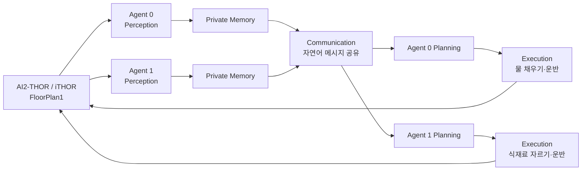

# CoELA-Lite on iTHOR: LLM 기반 다중 로봇 협업

<div align="center">
  <a href="https://www.youtube.com/watch?v=3WtgClsuYFA">
    
  </a>
  <br>
  <strong>▶ 이미지를 클릭하면 최종 실행 영상을 볼 수 있습니다.</strong>
</div>

<br>

> **개별연구(CSC 현장실습-지능형 사물인터넷 기술 개발)**<br>
> AI2-THOR의 iTHOR 환경에서 두 에이전트가 자연어로 역할을 조율하고, CoELA의 모듈 구조를 따라 장기 작업을 수행하도록 구현한 연구입니다.


## 연구 개요

물류·서비스 로봇의 Fleet Management System(FMS)은 여러 로봇에게 작업을 배정하고 진행 상황과 물동량을 관리해야 합니다. 이 연구에서는 고정 규칙이나 중앙집중형 작업 할당을 넘어, LLM의 자연어 추론과 통신을 이용해 에이전트가 다음 과정을 직접 수행하도록 구성했습니다.

1. 환경과 객체를 인식합니다.
2. 에이전트별 관측 내용을 독립적으로 기억합니다.
3. 자연어 메시지로 대상 객체와 역할을 조정합니다.
4. 겹치지 않는 고수준 행동 계획을 생성합니다.
5. 계획을 AI2-THOR의 실행 가능한 행동으로 변환합니다.

연구 소개 자료는 [개별연구소개(FMS).pdf](<./개별연구소개(FMS).pdf>)에서 확인할 수 있습니다.

## 연구 목표와 진행 과정

| 단계 | 내용 | 결과 |
|---|---|---|
| 1 | iTHOR(AI2-THOR) 시뮬레이터를 이용한 다중 로봇 작업 수행 테스트 | 2개 에이전트의 이동·관측·객체 조작 및 영상 생성 파이프라인 구축 |
| 2 | CoELA 공개 코드 설치 및 구조 분석 | TDW-MAT·C-WAH 구현과 통신형 LLM 에이전트 구조 분석 |
| 3 | 프롬프트 엔지니어링 기반 CoELA-Lite 직접 구현 | iTHOR에 맞춘 인식·기억·통신·계획·실행 모듈 구현 |
| 4 | 장기 협업 과제 수행 및 결과 검증 | 물 채우기와 식재료 자르기를 역할 분담해 모두 완료 |
| 5 | 논문·구현 내용 정리 및 최종 발표 | 실행 영상, 프롬프트, 메모리, 전체 trace 아카이빙 |

## CoELA-Lite 구조



본 구현은 원본 CoELA를 AI2-THOR에 그대로 이식한 것이 아닙니다. 원본 CoELA가 사용한 TDW-MAT/C-WAH 환경을 분석한 뒤, 논문의 모듈 아이디어인 **Perception → Memory → Communication → Planning → Execution**을 iTHOR API에 맞게 재구성한 독립적인 경량 구현입니다.

### 모듈별 역할

| 모듈 | 구현 내용 |
|---|---|
| Perception | 에이전트별 시야와 객체 metadata에서 집기·놓기·토글·자르기·채우기 가능 상태 수집 |
| Memory | 각 에이전트가 관측한 객체, 위치, 상태와 마지막 관측 시각을 개별 보관 |
| Communication | 목표, 기억, 기존 메시지를 바탕으로 역할·대상·목적지를 JSON 형식의 자연어 메시지로 공유 |
| Planning | 중복 할당을 피하며 고수준 행동 시퀀스를 생성하고 시나리오 제약으로 정규화 |
| Execution | 이동, 집기, 수도 조작, 물 채우기, 자르기, 운반, 내려놓기를 AI2-THOR action으로 실행 |

LLM은 로컬 Ollama의 `qwen3:8b`를 사용합니다. Ollama가 응답하지 않거나 JSON 파싱에 실패하면 결정론적 휴리스틱으로 복구할 수 있어 데모를 재현할 수 있습니다.

## 최종 실험

최종 실험은 `FloorPlan1` 주방에서 두 에이전트가 서로 다른 장기 작업을 맡는 시나리오입니다.

| 에이전트 | 할당 작업 | 실행 결과 |
|---|---|---|
| Agent 0 | Bowl 선택 → Faucet 이동 → 물 채우기 → CounterTop으로 운반 | 성공 |
| Agent 1 | Lettuce 선택 → 자르기 → CounterTop으로 운반 | 성공 |

최종 trace 기준으로 `pickup_object 2/2`, `put_object 2/2`, `fill_object_with_liquid 1/1`, `slice_object 1/1`, `toggle_object_on 1/1`, `toggle_object_off 1/1`을 기록했습니다. 이는 최종 데모 에피소드 1회에 대한 실행 검증 결과이며, 일반화 성능을 나타내는 벤치마크 수치는 아닙니다.

- [YouTube 최종 실행 영상](https://www.youtube.com/watch?v=3WtgClsuYFA)
- [저장소 내 최종 MP4](./ithor_demo/ithor_coela_lite_kitchen_prep_v18_1080p_slow_final/ithor_coela_lite_demo.mp4) — 1920×1080, 약 91초
- [전체 모듈·행동 trace](./ithor_demo/ithor_coela_lite_kitchen_prep_v18_1080p_slow_final/coela_lite_trace.json)
- [에이전트별 메모리](./ithor_demo/ithor_coela_lite_kitchen_prep_v18_1080p_slow_final/agent_memories.json)
- [LLM 프롬프트 기록](./ithor_demo/ithor_coela_lite_kitchen_prep_v18_1080p_slow_final/llm_prompts.json)

## 저장소 구조

```text
.
├── README.md
├── requirements.txt
├── 개별연구소개(FMS).pdf
├── CoELA/                         # 공식 CoELA 저장소 submodule
├── patches/
│   └── coela-local-changes.patch # 실습 중 원본 CoELA에 적용한 변경
└── ithor_demo/
    ├── ithor_coela_lite_demo.py  # 최종 CoELA-Lite 구현
    ├── ithor_action_probe.py     # iTHOR action 사전 검증
    ├── ithor_multi_demo.py       # 기본 다중 에이전트 실험
    ├── ithor_prompt_planner_demo.py
    ├── ithor_coela_style_demo.py
    ├── ithor_coela_style_demo_v3.py
    └── ithor_coela_lite_kitchen_prep_v18_1080p_slow_final/
        ├── ithor_coela_lite_demo.mp4
        ├── coela_lite_trace.json
        ├── agent_memories.json
        └── llm_prompts.json
```

6 GB가 넘는 프레임과 반복 실험 디렉터리, 로그, 설치 파일은 Git 이력에서 제외했습니다. 최종 결과와 재현에 필요한 코드·기록은 저장소에 포함합니다.

## 실행 방법

### 1. 저장소와 CoELA 받기

```bash
git clone --recurse-submodules https://github.com/I-kotori/ithor-coela-multi-agent-research.git
cd ithor-coela-multi-agent-research
```

이미 일반 clone을 했다면 다음 명령으로 submodule을 받습니다.

```bash
git submodule update --init --recursive
```

### 2. Python 환경 구성

검증한 환경은 Ubuntu, Python 3.9.25, AI2-THOR 5.0.0입니다.

```bash
conda create -n ithor python=3.9 -y
conda activate ithor
python -m pip install -r requirements.txt
```

Linux에서 화면 없이 실행하려면 AI2-THOR의 Cloud Rendering 설정 등 별도 렌더링 구성이 필요할 수 있습니다. 기본 스크립트는 그래픽 환경에서 실행하도록 작성되었습니다.

### 3. 선택 사항: 로컬 LLM 준비

```bash
ollama pull qwen3:8b
ollama run qwen3:8b
```

Ollama 없이 휴리스틱 경로만 확인하려면 실행 명령에 `--no-llm`을 사용합니다.

### 4. 최종 kitchen-prep 시나리오 실행

```bash
python ithor_demo/ithor_coela_lite_demo.py \
  --scene FloorPlan1 \
  --scenario kitchen-prep \
  --output outputs/kitchen-prep \
  --width 1920 \
  --height 1080 \
  --fps 6 \
  --llm-model qwen3:8b \
  --overwrite
```

실행 후 output 디렉터리에 영상, 전체 trace, 에이전트별 메모리, 프롬프트 기록이 생성됩니다.

### 5. CoELA 원본 실습 변경 재현

submodule은 공식 CoELA의 `3e12dea` 커밋을 가리킵니다. 실습 중 사용한 해상도 및 TDW 프로세스 종료 처리는 패치로 분리했습니다.

```bash
git -C CoELA apply ../patches/coela-local-changes.patch
```

## 참고 자료

- [AI2-THOR / iTHOR 공식 문서](https://ai2thor.allenai.org/ithor/documentation/)
- [CoELA 논문 — Building Cooperative Embodied Agents Modularly with Large Language Models](https://arxiv.org/abs/2307.02485)
- [CoELA 공식 구현](https://github.com/UMass-Embodied-AGI/CoELA)
- [CoELA 프로젝트 페이지](https://umass-embodied-agi.github.io/CoELA/)

## 주의 사항

- `CoELA/`의 저작권과 라이선스는 원본 프로젝트의 조건을 따릅니다.
- 이 저장소의 CoELA-Lite 구현은 연구·실습 및 재현을 위한 프로토타입입니다.
- 실행 결과는 AI2-THOR 빌드, 렌더링 환경, 모델 응답에 따라 달라질 수 있습니다.
